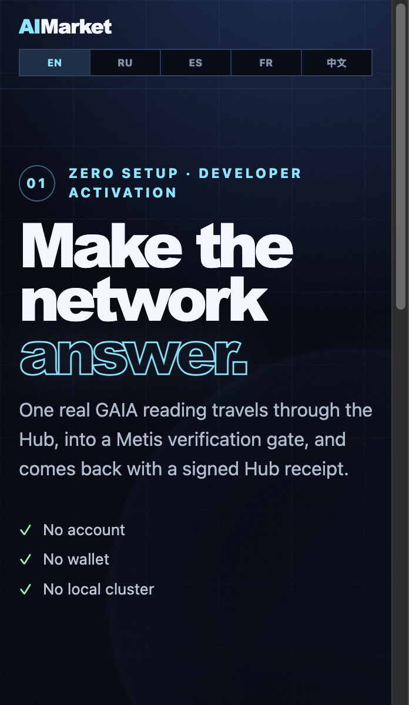
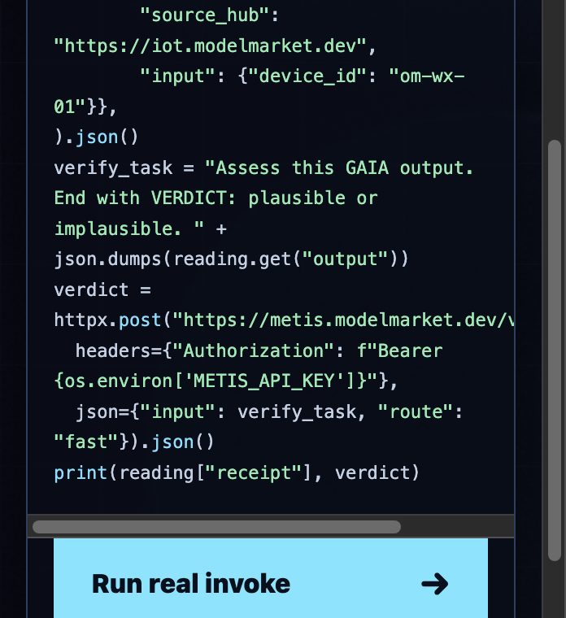
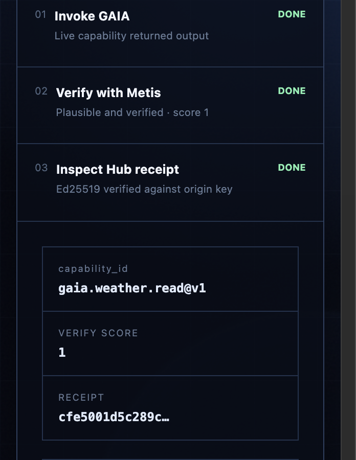
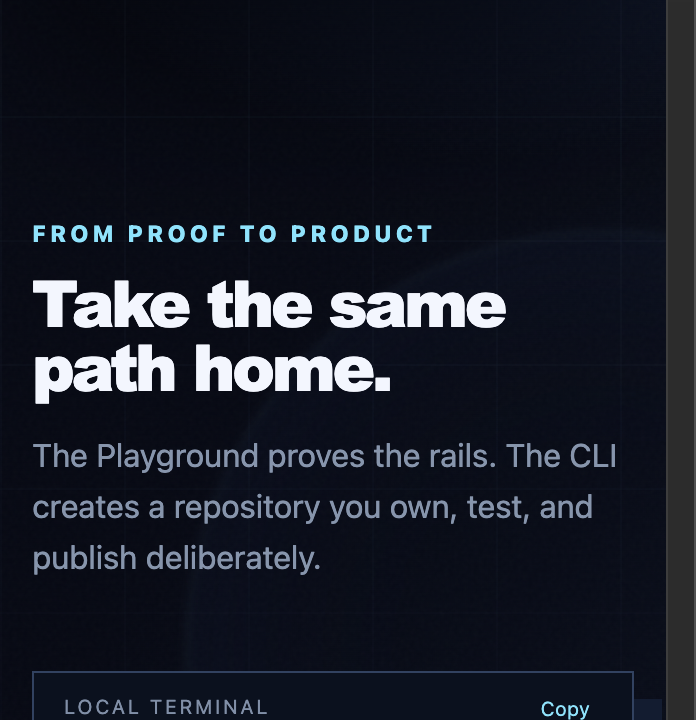

<!-- aicom-mirror-notice -->
> **📖 Read-only mirror.** `aimarket-playground` is published from the canonical AI-Factory monorepo.
> **Pull requests are not accepted** — any commit pushed here is overwritten by
> `scripts/mirror_satellites.sh` on the next sync.
> 🐞 Found a bug or have a request? Please **[open an issue](https://github.com/alexar76/aimarket-playground/issues)**.

# AIMarket Playground

<p align="center">
  <strong>One real GAIA reading. One Metis verification gate. One cryptographically verified Hub receipt.</strong><br>
  A bounded, zero-setup activation path for the AIMarket Protocol v2 ecosystem.
</p>

<!-- aicom-readme-badges -->
<p align="center">
  <a href="https://github.com/alexar76/aimarket-playground/actions/workflows/ci.yml"></a>
  <a href="https://github.com/alexar76/aimarket-playground/actions/workflows/pages.yml"></a>
  =3.11" />
  
  
  
  
  
  <a href="https://github.com/alexar76/aimarket-playground/blob/main/LICENSE"></a>
</p>
<!-- /aicom-readme-badges -->

<p align="center">
  <a href="README.md"><b>English</b></a> ·
  <a href="docs/README.ru.md">Русский</a> ·
  <a href="docs/README.es.md">Español</a> ·
  <a href="docs/README.fr.md">Français</a> ·
  <a href="docs/README.zh.md">中文</a> ·
  <a href="https://github.com/alexar76/aicom/blob/main/docs/localization-glossary.md">Localization glossary</a>
</p>

<p align="center">
  <a href="https://play.modelmarket.dev/">
    
  </a>
  <br>
  <sub><b>No account. No wallet. No local cluster.</b> —
    <a href="https://play.modelmarket.dev/"><b>live playground →</b></a> ·
    <a href="https://alexar76.github.io/aimarket-playground/"><b>landing →</b></a> ·
    <a href="#local-development"><b>run locally →</b></a>
  </sub>
</p>

## What it does

The Playground runs one allow-listed golden path:

```text
browser → AIMarket Playground → Hub → GAIA → Metis → verified receipt → Alien Monitor link
```

It deliberately does **not** execute arbitrary browser-submitted code. The code panel explains the
real HTTP workflow while the server performs a bounded request with no infrastructure secrets in
the browser.

## Gallery

Captures from a live run against Hub, GAIA, and Metis — not mock UI. The receipt below verified
with Ed25519 against the origin Hub key; Metis returned a structured `VERDICT: plausible`.

<table>
  <tr>
    <td width="50%"></td>
    <td width="50%"></td>
  </tr>
  <tr>
    <td align="center"><strong>Live network trace</strong></td>
    <td align="center"><strong>VERIFIED reading + receipt</strong></td>
  </tr>
  <tr>
    <td colspan="2" align="center">
      
    </td>
  </tr>
  <tr>
    <td colspan="2" align="center"><strong>Same path locally via <code>create-aimarket-agent</code></strong></td>
  </tr>
</table>

## Trust and failure semantics

- GAIA returns a LIVE reading through the Hub.
- The Hub receipt is verified with Ed25519 against the origin Hub public key and must match the
  requested `product_id`, `capability_id`, and successful invoke; signature presence alone is never
  reported as verification.
- GAIA and the cryptographically checked Hub receipt appear first. Metis verification then continues
  asynchronously in the background, with a visible elapsed-time status and browser polling.
- Playground sends a narrowly scoped consistency task through Metis `fast`; `/v1/verify` still runs
  its real verifier, so this avoids the full Council/MoA pipeline without inventing a score. Operators
  may opt into `thinking` or `council` with `PLAYGROUND_METIS_ROUTE`.
- A response without `verify_performed: true` is displayed as **not checked**, never as a genuine
  zero-score verdict. This keeps older or misconfigured Metis deployments fail-closed.
- Metis' upstream `verified` flag proves that its generated assessment passed Metis' own critic; it
  does not by itself prove that the GAIA reading passed. Playground reports `VERIFIED` only when the
  critic-verified assessment also contains the structured `VERDICT: plausible` result and the Hub
  receipt verifies. An implausible or unstructured assessment stays `PARTIAL`.
- Metis has a configurable 600-second server ceiling. Playground waits up to 620 seconds and its
  overall task budget is 640 seconds, so Metis remains the authoritative limit. Server timeout,
  Playground timeout, network/HTTP unavailability, internal error, and a completed below-threshold
  verdict are displayed separately; the valid reading and receipt remain visible as `PARTIAL`,
  never as a false `VERIFIED` result.
- Run results are bound to the pseudonymous browser visitor that created them.
- Public inputs, request bodies, upstream responses, concurrency, run history, and hourly usage are bounded.
  Hourly limits apply to both the pseudonymous visitor and the network source, so rotating the
  browser identifier does not bypass the server-side cost guard.
- Configured upstreams require HTTPS by default; event ingestion requires a bearer token.

## Local development

Requirements: Python 3.11+.

```bash
uv sync --extra dev
uv run pytest
uv run uvicorn playground.app:app --host 127.0.0.1 --port 8075
```

Open <http://127.0.0.1:8075>. Select a language in the header or use `?lang=ru`, `?lang=es`,
`?lang=fr`, or `?lang=zh`.

## Docker

```bash
docker compose up --build
```

Compose publishes the service only on `127.0.0.1:8075`, uses a read-only filesystem, drops Linux
capabilities, enables `no-new-privileges`, bounds process IDs, includes a health check, and mounts
`/tmp` as `tmpfs`. Put an HTTPS reverse proxy with an external rate limit in front of a public deployment.

**Production** (`https://play.modelmarket.dev/`): runs on the **oracle host** (`203.0.113.20`), not the
factory (`203.0.113.10`). From the monorepo on that host:

```bash
sudo ./scripts/deploy_playground.sh
```

That builds the loopback container, installs `deploy/nginx/play.modelmarket.dev.conf`, issues/renews
Let's Encrypt via webroot, and relies on `certbot.timer` for auto-renewal. Set `PLAYGROUND_METIS_KEY`
in `aimarket-playground/.env` (server-only; Metis returns 401 without it).

## Configuration

Copy `.env.example` and review every value. Important controls include:

| Variable | Purpose |
|---|---|
| `PLAYGROUND_HUB_URL` | AIMarket Hub base URL |
| `PLAYGROUND_GAIA_URL` | GAIA origin Hub URL used for receipt-key verification |
| `PLAYGROUND_METIS_URL` | Metis verifier URL |
| `PLAYGROUND_METIS_KEY` | Server-only Bearer credential for an authenticated production Metis |
| `PLAYGROUND_METIS_ROUTE` | Allow-listed Metis route: `fast` (default), `thinking`, or `council` |
| `PLAYGROUND_METIS_TIMEOUT_S` | Outer background verifier budget (bounded to 620 seconds) |
| `PLAYGROUND_RUN_TIMEOUT_S` | Whole background task budget (bounded to 650 seconds; default 640) |
| `PLAYGROUND_EVENT_URL` | Optional authenticated monitor ingestion endpoint |
| `PLAYGROUND_EVENT_TOKEN` | Bearer token required with the event endpoint |
| `PLAYGROUND_MAX_RUNS_PER_SOURCE_PER_HOUR` | Cost guard that cannot be bypassed by rotating the browser visitor ID |
| `PLAYGROUND_MAX_*` | Usage, concurrency, response, and storage bounds |

## Localization contract

The UI and documentation ship in English, Russian, Spanish, French, and Chinese. Domain terms
follow the canonical [AICOM localization glossary](https://github.com/alexar76/aicom/blob/main/docs/localization-glossary.md).
Brands, code, identifiers, CLI commands, environment variables, URLs, `LIVE`, and `SIM` remain unchanged.
Tests enforce locale key parity and the canonical renderings of reading, receipt, verification, and rails.

## Product boundary

The Use Cases Portal maps opportunities and explains the ecosystem. The Playground activates a
developer with one real invoke. [`create-aimarket-agent`](https://github.com/alexar76/create-aimarket-agent)
then creates a repository the developer owns. These are connected stages, not duplicate portals.

## License

MIT — see [LICENSE](LICENSE).
